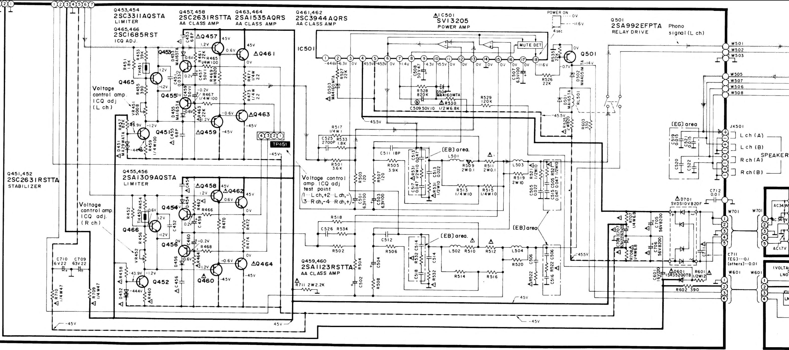

# Reference Fixture Qualification — 2026-09-01 To 2026-09-03

Lifecycle: **QUALIFICATION EVIDENCE — NOT AN OPERATING PROCEDURE**
Release: **PASS for controlled powered-amplifier bench use**
Current use: [`../fixtures/REFERENCE_FIXTURE_USE.md`](../fixtures/REFERENCE_FIXTURE_USE.md)
Current specification: [`../fixtures/REFERENCE_FIXTURE_SPECIFICATION.md`](../fixtures/REFERENCE_FIXTURE_SPECIFICATION.md)
Consolidated: 2026-09-06

## 1. Scope And Release Summary

This record consolidates the completed SU-V570 output-topology review, fixture electrical qualification, and proportionate AC commissioning. It preserves their dated evidence classes, raw readings, calculations, superseded branches, and release reasoning. It is retained for audit, rebuild, redesign, or failure investigation; do not use the historical procedures below as instructions for a live connection.

The SU-V570 unpowered topology, UMC202HD phantom isolation, complete resistance matrices, four-polarity clamp test, construction inspection, ground-path audit, UMC202HD output topology, three interconnect maps, and proportionate AC sanity check all passed. Optional powered amplifier-topology confirmation was waived after coherent low-resistance evidence. The fixture is approved for controlled bench use under the current inspection, connection, startup, and stop rules.

Current post-stress baseline: sleeve-to-ring `1.004 kohm`, sleeve-to-tip `1.002 kohm`, sleeve-to-In+ `10.130 kohm`, sleeve-to-In- `10.146 kohm`, ring-to-tip `2.006 kohm`, ring-to-In+ `11.133 kohm`, ring-to-In- `9.141 kohm`, tip-to-In+ `9.127 kohm`, tip-to-In- `11.149 kohm`, and In+-to-In- `20.275 kohm`. At approximately `64.5 V DC`, all four clamp-node magnitudes were `5.463-5.520 V`; the supply remained in CV mode at no more than indicated `6 mA`, with only mild expected resistor warming.

The corrected low-voltage AC path gave raw transfer `-20.45 dB`, consistent with the calculated `-20.094 dB` for a proportionate sanity check. Exact installed attenuation, noise, headroom, and dropout remain measurement-quality observations in the complete interface/amplifier chain rather than reasons to repeat completed high-voltage tests. Interface-specific contact, phantom, level, and stream qualification never transfer automatically.

## 2. Dated SU-V570 Output-Topology Record


Date prepared: 2026-08-31

Last revised: 2026-09-03

Status: **UNPOWERED COMMON-GROUND CHECK PASSED; OPTIONAL POWERED CHECK WAIVED;
REFERENCE FIXTURE RELEASED FOR CONTROLLED FULL-DUAL USE**

### 2.1 Purpose

Determine whether the Technics SU-V570 loudspeaker outputs are conventional
common-ground outputs suitable for the protected amplifier-output reference
fixture specified in
[current reference-fixture specification](../fixtures/REFERENCE_FIXTURE_SPECIFICATION.md).

This document deliberately separates:

- what the supplied schematic strongly indicates;
- what has now been established by external measurements;
- the optional powered confirmation, which was subsequently waived; and
- the connection that remains prohibited even though the amplifier passes.

### 2.2 Preserved Schematic Evidence

The supplied full-resolution image is preserved as:

[`SU-V570_power_amp_output_schematic.png`](../../../rew/SU-V570_power_amp_output_schematic.png)

SHA-256:

`35ED76E0E52DA1F5121D4609889CAB8289AD34F67FD5C9897FE1CB3A8E637D7C`



### 2.3 Schematic Assessment

The drawing strongly indicates a conventional common-signal-ground amplifier,
not a bridged or floating loudspeaker output.

Evidence:

1. Each negative speaker terminal at `JK501` is connected to a signal-ground
   symbol.
2. The left-channel active output reaches the positive terminals through
   output inductor `L503` and the speaker-protection relay.
3. The right-channel active output similarly reaches its positive terminals
   through `L504` and the relay.
4. Only one terminal of each loudspeaker output is actively driven. A bridged
   output would show a second power stage driving the nominal negative terminal.
5. The output stages operate from approximately `+45.5 V`, `0 V`, and `-45.5 V`.
   The loudspeaker return is the amplifier's signal `0 V`, associated with the
   midpoint of the split supply and its reservoir capacitors, not external
   earth.
6. The heavy vertical line through the connector circles appears to denote the
   connector or mechanical boundary. Electrical connections enter individual
   terminals horizontally.

This was strong schematic evidence. The 2026-09-01 resistance measurements in
Section 2.6 now externally support the common-ground conclusion. That result does
not by itself approve connection to the UMC202HD; the complete fixture has its
own construction, test, and release gates.

### 2.4 What C712 Does Not Mean

`C712` is marked `0.01`, interpreted as `0.01 uF = 10 nF`. It appears to bond
signal ground to chassis or external ground at high frequency. It is not in the
loudspeaker-current return path.

Its reactance is:

```text
Xc = 1 / (2 pi f C)
```

At 1 kHz:

```text
Xc = 1 / (2 pi x 1000 x 10e-9)
   = 15.9 kohm
```

A capacitor with `15.9 kohm` reactance cannot carry ampere-scale loudspeaker
return current. At 1 MHz its reactance is approximately `15.9 ohm`, which is
consistent with an RF, interference, or electrostatic ground bond.

The absence of a DC bond between signal ground and chassis ground is therefore
not evidence of a floating or bridged speaker output. Signal `0 V`, chassis,
protective earth, and speaker negative are related concepts but need not be the
same physical node.

**VERIFIED MEASUREMENT, 2026-09-01:** with the meter lead resistance nulled,
speaker negative measured approximately `0.10 ohm` to exposed bare-metal
chassis. If that was the settled reading after any charging transient, the
complete amplifier presents an effective low-resistance DC path between those
points in the tested, fully disconnected condition. The measurement does not
identify that path, and it does not change `C712` into the loudspeaker-current
return; a `10 nF` capacitor cannot explain a settled `0.10 ohm` DC result.

### 2.5 Safety Conditions For External Testing

For all resistance and continuity measurements:

1. Unplug the SU-V570 from the mains.
2. Disconnect every external cable, including speakers, RCA leads, and any
   measurement-interface connection. This prevents an external cable from
   manufacturing the continuity being tested.
3. Leave the amplifier disconnected long enough for its reservoir capacitors to
   discharge.
4. Use a battery-powered handheld multimeter.
5. Put the leads in `COM` and `V/ohm`, never the current socket.
6. Select resistance or continuity mode only after confirming that the
   amplifier is de-energised.
7. Do not open the case or probe internal mains or supply-rail nodes for this
   test.

Fluke's resistance-measurement guidance likewise requires circuit power to be
off and capacitors to be discharged:
<https://www.fluke.com/en-us/learn/blog/digital-multimeters/how-to-measure-resistance>

### 2.6 Required Unpowered Measurements

#### 2.6.1 Establish meter-lead resistance

Short the probes firmly together and record the reading. If the meter has a
relative or zero function, it may be used, but retain the original reading in
the table. If the reading is then nulled, compare subsequent measurements with
approximately `0 ohm`, not with the original lead reading.

```text
R_lead = 0.050 ohm
Math Null applied before the measurements in Section 2.6.2: YES
```

#### 2.6.2 Measure the speaker-return network

Use the exposed metal of the binding posts, not paint or oxidised surfaces.

| Test | Measured resistance | Expected result |
| --- | ---: | --- |
| Left A negative to Left B negative | `0.002 ohm` after null | Approximately `0 ohm` after null |
| Left A negative to Right A negative | `0.045 ohm` after null | Approximately `0 ohm` after null |
| Left A negative to Right B negative | `0.045 ohm` after null | Approximately `0 ohm` after null |
| Any speaker negative to AUX/CD RCA outer shell | `0.120-0.150 ohm`; mean `0.130 ohm`, after null | Low, stable DC resistance after null |
| Any speaker negative to bare metal chassis | `0.100 ohm` after null | May be low, rise, or show `OL`; not a pass criterion |

Repeat questionable readings after reversing the probes and improving contact.
An in-circuit capacitor can cause a changing reading while it charges. That is
particularly relevant to the chassis measurement and is not itself a failure.

#### 2.6.3 Unpowered decision gate

Treat the common-ground topology as externally supported if:

- all four negative speaker terminals are mutually continuous at very low,
  stable resistance; and
- a speaker negative has similarly unambiguous low-resistance DC continuity to
  an input RCA outer shell.

Without a meter null, very low readings should be approximately the meter-lead
resistance plus contact and internal path resistance. With a meter null, as in
the 2026-09-01 measurements, the displayed result should instead be near zero
plus contact and internal path resistance.

The speaker-negative-to-chassis reading is not a pass criterion. A high,
changing, or open DC reading is compatible with the `C712` RF bond.

Stop and reassess the schematic if:

- left and right negative terminals are not mutually continuous;
- speaker negative is not continuous with RCA signal ground; or
- a reading changes materially with the speaker-bank selector in a way not
  explained by contact resistance.

Do not proceed to a powered test until the unpowered readings have been reviewed.

#### 2.6.4 2026-09-01 review result

**VERIFIED MEASUREMENT:** all speaker-negative terminals are mutually
continuous. The `0.002 ohm` same-channel A-to-B result is effectively zero for
this two-wire measurement. The `0.045 ohm` cross-channel results are still a
very low metallic path and may include binding-post contact, internal wiring,
PCB trace, and probe-contact resistance.

**VERIFIED MEASUREMENT:** every speaker negative has stable low-resistance DC
continuity to AUX/CD RCA signal ground. The `0.120-0.150 ohm` range is far below
a value that could plausibly represent only capacitive coupling or incidental
leakage. Its small spread is consistent with ordinary two-wire contact and path
variation.

The Keysight U1282A `60 ohm` range has `0.001 ohm` resolution and specified
accuracy of `+/- (0.15% of reading + 20 counts)` after Math Null, or about
`+/-0.020 ohm` for these readings under the datasheet conditions. The exact
milliohm differences should therefore not be over-interpreted; the topology
distinction is nevertheless decisive.

**DECISION:** Section 2.6 passes. The measurements externally support a
conventional common-signal-ground output and rule against treating the SU-V570
as a bridged or floating-output amplifier for this measurement plan.

### 2.7 Optional Powered Confirmation - Waived

**USER DECISION, 2026-09-01:** the successful unpowered gate is accepted as
sufficient evidence for this measurement plan, so the optional low-voltage
powered topology confirmation will not be performed. This does not waive the
separate UMC202HD, fixture, or AC release gates. No blank result sheet or
superseded procedure is retained.

### 2.8 Prohibited Test Connections

Do not:

- connect a speaker output directly to a UMC202HD input;
- place a multimeter in current mode across any speaker or supply output;
- use a USB-connected meter for the powered topology check;
- attach an earth-grounded oscilloscope ground clip to either speaker terminal;
- infer a safe connection merely because the amplifier plays normally;
- bypass the fixture's voltage clamps or commissioning measurements.

### 2.9 Consequence For The UMC202HD Reference

The passed Section 2.6 gate makes the SU-V570 suitable in principle for the
protected amplifier-output reference. It does not authorize a direct
speaker-output-to-interface connection. Use the symmetric two-leg high-value
fixture in
[the reference-fixture specification](../fixtures/REFERENCE_FIXTURE_SPECIFICATION.md);
neither speaker lead is hard-connected to UMC202HD sleeve.

That arrangement remains preferable for this common-ground amplifier because it
avoids a second low-resistance bond through the reference input. The separately
audited playback path already provides the expected SU-V570-to-UMC202HD signal
ground and references it through USB and the Class-I PC to protective earth.
These are signal-path findings, not an appliance-safety or protective-conductor
test.

The completed ground readings, UMC202HD rear-output tests, PCB inspection, and
TS playback-cable decision are retained without duplication in
[the qualification record](REFERENCE_FIXTURE_QUALIFICATION_2026-09-01_TO_03.md).
The rear sockets are mechanically TRS but electrically tip plus a permanent
ring/sleeve common, so the mapped TS-to-RCA playback cable is compatible with
these specific outputs. The amplifier's approximately `+/-45.5 V` rails define
the fixture design envelope.

**CURRENT GATE, 2026-09-03:** amplifier topology passes, the optional powered
confirmation is waived, and
[the proportionate fixture AC release](REFERENCE_FIXTURE_QUALIFICATION_2026-09-01_TO_03.md)
passes. Controlled powered-amplifier/full-dual use is approved under the
fixture and acoustic-checkout startup and stop rules.

### 2.10 Final Status Record

```text
Schematic assessment:       LIKELY COMMON-GROUND
Unpowered measurements:     PASS - 2026-09-01
Powered confirmation:       WAIVED - optional, 2026-09-01
Current specification:       REFERENCE_FIXTURE_SPECIFICATION.md
Current use procedure:       REFERENCE_FIXTURE_USE.md
Completed evidence:          this consolidated record, Sections 2-4
AC release record:           this consolidated record, Section 4 - PASS
Fixture release status:     YES - controlled bench use
Approved for full-dual use: YES - under documented startup/stop rules

Reviewed by: Codex review of user-reported readings and ground-path analysis
Date:        2026-09-03
Notes:
Section 2.6 passes and externally supports the schematic common-ground
assessment. The optional powered confirmation was waived. Fixture construction,
completed evidence, and the proportionate AC release decision are separated
into the three records named above. Exact reference level, noise, and dropout
behaviour remain first-full-dual measurement-quality checks.
```

### 2.11 Supporting Sources

Keysight specifies the U1282A low-resistance range, resolution, accuracy after
Math Null, and null procedure in the U1280 Series data sheet:
<https://www.keysight.com/us/en/assets/7018-04867/data-sheets/5992-0847.pdf>

The Technics operating instructions show normal line-level interconnection and
direct users to connect the AC power cord only after the other cables:
<https://www.manualslib.com/manual/3432378/Technics-Su-V570.html?page=5>

The Technics SU-V570 service manual gives the power-amplifier rail notation and
output topology used in the schematic assessment:
<https://audiocircuit.dk/downloads/technics/Technics-SUV570-int-sm.pdf>
## 3. Dated Fixture Electrical-Qualification Record


Date range: 2026-09-01 to 2026-09-03

Last revised: 2026-09-05

Status: **COMPLETED QUALIFICATION EVIDENCE; NOT THE CURRENT OPERATING PROCEDURE**

This record preserves the measurements and reasoning that qualified the
amplifier-output fixture through its phantom-isolation, resistance, DC clamp,
physical-construction, ground-path, and interface-output-topology gates. It
removes the superseded step-by-step dialogue and keeps the evidence needed to
audit the current decisions.

Use:

- [Reference-fixture specification](../fixtures/REFERENCE_FIXTURE_SPECIFICATION.md)
  for the construction specification and release state;
- Section 4 below for the subsequently completed proportional AC gate; and
- Section 2 above for the SU-V570 common-ground evidence.

Unless stated otherwise, resistance measurements used the battery-powered
Agilent/Keysight U1282A with nulled leads. Reported milliohm values classify
topology; they are not four-wire precision measurements or appliance-safety
certification.

### 3.1 UMC202HD Input 2 Phantom Isolation

The decision test loaded the central Input 2 TRS contacts with equal
`100 kohm`, 1%, at least `0.25 W` resistors:

```text
Tip  ----- 100 kohm -----+
                         +----- Sleeve
Ring ----- 100 kohm -----+
```

A conventional `48 V` phantom feed through `6.8 kohm` would leave
`48 x 100 / 106.8 = 44.9 V` across either load, so this network cannot hide a
real sustained P48 feed.

**USER-REPORTED MEASUREMENT, 2026-09-01:** with the U1282A in normal DCV mode
on its `+/-60 V` range and `+48 V` off, tip-sleeve and ring-sleeve settled
below `1 mV` within `25 s`; tip-ring settled below `1 mV` within `1 s`.
Without power-cycling the interface, every pair then remained at a displayed
`0.000 V` while `+48 V` was switched on and off separately for that
measurement.

**DECISION - PASS:** no sustained or settling phantom voltage reaches the Input
2 central TRS contacts under the defined load.

An earlier unloaded, high-impedance observation recorded a brief approximately
`3.3 V` power-up peak, rapid fall, slow rise towards `1.5 V`, and
minutes-long decay. That behaviour is retained as evidence of stored charge or
bias/meter interaction, but it was superseded as the decision test by the
loaded result above.

### 3.2 Complete-Fixture Resistance Qualification

#### 3.2.1 Construction History And Component Evidence

The first physical version was a one-leg attenuator: red reached tip through
`9.1 kohm`, tip had `1 kohm` to sleeve, black was hard-connected to sleeve,
and ring was open. Its approximate `10 kohm` red-black, `1 kohm`
tip-sleeve, ring-open signature exposed that topology; it was rejected and
rebuilt. A first rework check was also superseded because body contact and one
duplicated label produced inconsistent redundant sums. The hands-off
complete-unit matrix below is the accepted pre-stress baseline.

All four resistors are user-reported 1% metal-film axial parts sourced from
Mouser. The `9.1 kohm` series parts are rated `0.5 W` with working voltage
above `100 V`; the `1 kohm` shunts are rated `0.25 W`. Manufacturer and
part numbers were not retained.

The four diodes are marked `BZX 5V1`; exact manufacturer, family suffix,
tolerance grade, and rating are unknown. Each sample measured close to `5 V`
at `2 mA` on the user's zener analyser. Each node uses an anode-to-anode
series-opposed pair, with the joined midpoint insulated and connected nowhere
else. These facts characterize the installed devices without inventing a full
part number.

#### 3.2.2 Accepted Pre-Stress Matrix

**USER-REPORTED MEASUREMENT, 2026-09-02:** after the final rebuild, the
disconnected complete cable-to-TRS unit was measured with the U1282A in
resistance mode on its `60 kohm` range. Leads were nulled and no body part
contacted the circuit. Values are in `kohm`; `In+` is red and `In-` black.

| From / to | Ring | Tip | In+ | In- |
| --- | ---: | ---: | ---: | ---: |
| Sleeve | `1.003` | `1.002` | `10.127` | `10.142` |
| Ring | - | `2.005` | `11.131` | `9.139` |
| Tip | - | - | `9.125` | `11.145` |
| In+ | - | - | - | `20.271` |

The six independently redundant sums close within `0-2 ohm`. For example,
`9.125 + 1.002 = 10.127 kohm` exactly for In+-sleeve, while the largest
closure is `20.271 - (9.125 + 1.002 + 1.003 + 9.139) = 2 ohm`. The measured
`9.125`, `9.139`, `1.002`, and `1.003 kohm` branches are respectively
`0.275%`, `0.429%`, `0.200%`, and `0.300%` above nominal, all within
1%. The calculated unloaded differential gain is `-20.094 dB`.

**DECISION - PASS:** the complete unit has the required symmetric two-leg
topology, neither input lead is hard-connected to sleeve, and the meter reveals
no short or material low-voltage diode leakage.

### 3.3 Integrated PL310QMD DC Clamp Qualification

#### 3.3.1 Test Configuration

The TTi PL310QMD was used in its series mode to drive one complete
amplifier-end-to-TRS branch at a time. Both section current limits were
`10 mA`. The Agilent U1272A measured supply magnitude in DCV mode on its
`300 V` range; the U1282A measured node-to-sleeve voltage in DCV mode on its
`60 V` range. The UMC202HD and SU-V570 were absent.

| Curve | PL310QMD HI | PL310QMD LO | Measured node |
| --- | --- | --- | --- |
| Tip positive | Red | Black and sleeve | Tip relative to sleeve |
| Tip negative | Black and sleeve | Red | Tip relative to sleeve |
| Ring positive | Black | Red and sleeve | Ring relative to sleeve |
| Ring negative | Red and sleeve | Black | Ring relative to sleeve |

With no clamp current, the measured divider ratios predict
`Vtip = 0.098943 Vsupply` and `Vring = 0.098896 Vsupply`. The test required a
clear high-voltage knee, node magnitude no greater than `6.2 V`, positive/
negative symmetry within approximately `0.3 V`, current below `10 mA`, CV
operation, no abnormal heating, and an unchanged cooled resistance matrix. The
original linearity target was approximately `+/-1%` through the amplifier's
`45.5 V` rail envelope.

#### 3.3.2 Raw Four-Curve Results

All values below are DC volts. Each cell gives actual supply magnitude / signed
node voltage.

| Nominal source | Tip positive | Tip negative | Ring positive | Ring negative |
| ---: | ---: | ---: | ---: | ---: |
| `10 V` | `10.03 / 0.990` | `9.99 / -0.989` | `10.05 / 0.990` | `9.99 / -0.990` |
| `20 V` | `19.95 / 1.973` | `19.92 / -1.974` | `20.09 / 1.986` | `20.00 / -1.978` |
| `30 V` | `29.98 / 2.964` | `29.96 / -2.965` | `30.02 / 2.969` | `29.96 / -2.963` |
| `40 V` | `40.07 / 3.949` | `40.08 / -3.948` | `40.12 / 3.955` | `40.09 / -3.954` |
| `45.5 V` | `45.56 / 4.459` | `45.53 / -4.449` | `45.53 / 4.454` | `45.62 / -4.467` |
| `50 V` | `50.06 / 4.841` | `50.05 / -4.819` | `50.16 / 4.849` | `50.12 / -4.846` |
| `55 V` | `55.10 / 5.183` | `55.10 / -5.140` | `55.00 / 5.167` | `55.16 / -5.185` |
| `60 V` | `60.21 / 5.400` | `60.12 / -5.351` | `60.03 / 5.394` | `60.16 / -5.403` |
| nominal `64 V` | `64.50 / 5.520` | `64.49 / -5.463` | `64.48 / 5.515` | `64.46 / -5.515` |

The supply remained in constant-voltage mode throughout every run. It indicated
at most `6 mA`, consistent with derived maximum series currents of
`6.450-6.469 mA` given its display accuracy. Heating was assessed tactually,
not instrumentally: the fixture became only mildly warmer than ambient, with no
smell, discoloration, rapid hot spot, or other concern. The calculated maximum
series-resistor dissipation is approximately `0.380-0.382 W`, so mild warming
of a `0.5 W` part is expected. Derived maximum clamp current is approximately
`0.951-1.017 mA`, only about `5.2-5.6 mW` in a pair.

#### 3.3.3 Curve Decision

| Curve | Departure at approximately `45.5 V` | Node at maximum | Unclamped prediction | Clamp reduction |
| --- | ---: | ---: | ---: | ---: |
| Tip positive | `-1.08%` | `5.520 V` | `6.382 V` | `0.862 V` |
| Tip negative | `-1.24%` | `-5.463 V` | `-6.381 V` | `0.918 V` |
| Ring positive | `-1.08%` | `5.515 V` | `6.377 V` | `0.862 V` |
| Ring negative | `-0.99%` | `-5.515 V` | `-6.375 V` | `0.860 V` |

All curves agree with the unloaded divider within `0.45%` through `40 V`,
then enter the same smooth knee. At maximum source, magnitudes span only
`5.463-5.520 V`; the ring pair both read `5.515 V`. Three curves narrowly
miss the approximate 1% criterion at `45.5 V`, with the worst miss only
`0.24` percentage point. This is no more than about `0.11 dB` compression
at the rail envelope and has no material consequence near the intended
`1 V RMS` amplifier output, where the clamp is inactive.

**DECISION - PASS WITH CHARACTERIZED 45.5 V LINEARITY DEVIATION:** the four
curves verify correct polarity, bidirectional clamp action, close symmetry,
bounded current, CV operation, and expected thermal behaviour. The decision
does not misstate the three `0.99-1.24%` results as exact compliance.

#### 3.3.4 Cooled Post-Stress Matrix

**USER-REPORTED MEASUREMENT, 2026-09-02:** after cooling, the disconnected unit
was remeasured with the same U1282A `60 kohm` setup and nulled leads. The room
may have cooled slightly during the evening.

| From / to | Ring | Tip | In+ | In- |
| --- | ---: | ---: | ---: | ---: |
| Sleeve | `1.004` | `1.002` | `10.130` | `10.146` |
| Ring | - | `2.006` | `11.133` | `9.141` |
| Tip | - | - | `9.127` | `11.149` |
| In+ | - | - | - | `20.275` |

Every direct path changed by only `0-4 ohm`; all post-stress redundant sums
close within `0-2 ohm`. The largest change is approximately `0.04%` of a
`10.1 kohm` path and the branch changes are at most `0.10%` of a `1 kohm`
shunt. Their all-positive sign is not used to infer a temperature coefficient.

**DECISION - PASS:** there is no evidence of resistor damage, open clamp,
changed connection, or new leakage path. This closes the integrated DC gate.

### 3.4 Physical-Construction Qualification

**USER-REPORTED INSPECTION, 2026-09-03:** the unmarked `2 m`, `1.5 mm^2`
red/black figure-of-eight input cable remains joined except for approximately
`5 cm` at its secure, insulated, strand-free bare-wire speaker termination
and `2 cm` at the fixture. Red denotes positive and black negative.

Every component, exposed lead, and junction is individually heat-shrink
insulated before overlapping outer layers form an approximately `6 cm`,
normally inflexible body. Tapered layers and internal wire returns provide
strain relief; a moderate pull reaches no solder joint. The joined-anode diode
midpoints are separately insulated. Sleeve is the common junction for both
`1 kohm` shunts, both clamp endpoints, and the output-tail sleeve conductor.

The approximately `5 cm` output tail uses three twisted, individually
insulated `14/0.7` hookup wires rather than screened cable. The unknown-make
all-metal TRS plug has distinct contacts, a plastic cylindrical terminal
insulator, clamp-jaw strain relief, a sleeve-bonded body, and an appropriate
Input 2 `LINE` label.

**DECISION - PASS FOR CONTROLLED BENCH USE:** the construction has also
survived the `64.5 V DC` sweeps and post-stress resistance check. No
heat-shrink dielectric, temperature, flame, or abrasion rating is claimed, so
this is not approval for permanent, crushed, abraded, unattended, or production
use. The unscreened tail is a performance uncertainty, not a demonstrated
safety fault. The later proportionality review moved no-signal observation into
the complete powered checkout, where it passed; see the completed AC record.

### 3.5 Unpowered System Ground-Path Audit

#### 3.5.1 Measured Paths

Every device was unpowered and disconnected as required. The one PC stage was
performed with the PC shut down, mains plug removed from the wall, every other
cable removed, and only its Class-I power cord retained to expose the free
plug's protective-earth pin. Considerable probe pressure was needed on chassis
metal, so the last digit is not treated as precision data.

| Stage | Measurement | Result |
| --- | --- | ---: |
| UMC202HD alone | Input 2 sleeve to bare chassis | `OPEN` |
| UMC202HD alone | Input 2 sleeve to USB shell | `0.035 ohm` |
| UMC202HD alone | Bare chassis to USB shell | `OPEN` |
| Chassis contact control | Two separated bare chassis points | `0.013 ohm` |
| Intended USB cable alone | Plug shell to plug shell | `0.130 ohm` |
| PC alone | USB socket shell to bare chassis | `0.170 ohm` |
| PC alone | Chassis to free mains-plug PE pin | `0.245 ohm` |
| PC plus USB and UMC202HD | Input 2 sleeve to PC chassis | `0.412 ohm` |
| PC plus USB and UMC202HD | Input 2 sleeve to free-plug PE pin | `0.379 ohm` |
| Playback cable | Two-contact TS tip to RCA centre / shell | `0.244 ohm` / `OPEN` |
| Playback cable | TS sleeve to RCA centre / shell | `OPEN` / `0.078 ohm` |
| Isolated UMC202HD output | Ring to sleeve through verified TRS breakout | `0.021 ohm`; breakout alone `OPEN` |
| Joined only by intended dual playback cable | Input 2 sleeve to corresponding SU-V570 RCA shell | `0.061 ohm` |
| Same connected state | Input 2 sleeve to corresponding speaker negative | `0.174 ohm` |
| Fixture alone, evidence reused from post-stress matrix | In+ / In- to sleeve | `10.130 / 10.146 kohm` |

The `0.013 ohm` chassis control validates both open UMC202HD enclosure
readings. Thus Input 2 sleeve is hard-bonded to USB shell but DC-isolated from
the tested enclosure metal. The idealized separate shell-path sum to PC chassis
is `0.035 + 0.130 + 0.170 = 0.335 ohm`, only `0.077 ohm` below the directly
measured `0.412 ohm`. Exact scalar addition is not expected from remade
two-wire contacts, a distributed chassis, mated connectors, and possible
parallel shield/circuit-ground paths.

The PC measurements verify a low-resistance route from interface sleeve through
USB shell/cable and PC chassis to protective earth. This is an ordinary
signal-reference topology result, not a protective-conductor resistance test.
Never defeat PC protective earth to cure hum.

The connected result leaves approximately
`0.174 - 0.061 = 0.113 ohm` beyond the RCA shell. This agrees with the
independent SU-V570 `0.120-0.150 ohm` speaker-negative-to-RCA-shell range
(mean `0.130 ohm`) within contact uncertainty and possible parallel paths
through the dual cable.

**DECISION - PASS:** every low-resistance path is explained. The playback cable
provides the expected single signal-ground bond between UMC202HD sleeve and the
SU-V570 common signal ground; the fixture independently retains kilo-ohm
isolation from both amplifier leads.

### 3.6 UMC202HD Rear-Output Topology

The official connector description alone did not establish whether a TS plug
could safely ground a rear output's ring. Three independent observations now
do:

1. an otherwise isolated, unpowered rear output measured `0.021 ohm` from
   ring to sleeve through a breakout that was open when unplugged;
2. powered `1 kHz` measurements, with REW driving only the channel under
   test, gave:

   | Output | Tip-sleeve | Ring-sleeve | Tip-ring |
   | --- | ---: | ---: | ---: |
   | 1 | `78.69 mV` | `0.002 mV` | `78.73 mV` |
   | 2 | `78.9 mV` | `0.000 mV` | `78.84 mV` |

3. internal inspection found physical three-contact TRS sockets with all three
   through-hole terminals soldered; on both footprints, the separate ring and
   sleeve pads connect through four-spoke thermals to the same PCB copper fill.

An earlier Output 1 row taken while REW accidentally drove Output 2 gave
`0.002/0.001/27.42 mV`. It violates the voltage triangle for one steady
circuit state and was discarded as invalid, not treated as a hardware fault.
Output 2's correctly driven row remained valid and was not repeated.

**DECISION - PASS:** both rear sockets are mechanically TRS but electrically
tip plus a permanent ring/sleeve common, equivalent to TS signal topology. The
mapped mono TS-to-RCA playback cable therefore adds no new short of an active
cold leg. The Output 2 fixture-test adaptor may be TS, or TRS with ring open or
joined to sleeve; tip drives red and common drives black. The direct Output
2-to-front-Input 2 baseline must remain TRS-to-TRS because the front input ring
is a distinct balanced-input contact.

### 3.7 Qualification Summary

| Gate | Decision |
| --- | --- |
| SU-V570 common-ground prerequisite | PASS under separate topology record |
| UMC202HD Input 2 phantom isolation | PASS |
| Complete-unit pre-stress resistance | PASS |
| Physical construction | PASS for controlled bench use |
| Four-polarity DC clamp function | PASS with characterized `45.5 V` deviation |
| Cooled post-stress resistance | PASS |
| Complete unpowered ground-path audit | PASS |
| UMC202HD rear-output topology | PASS; mechanically TRS, electrically TS |
| Proportionate AC sanity/release review | PASS under separate AC record, 2026-09-03 |
| Approved for powered-amplifier use | **YES - controlled UMC202HD bench use under documented rules** |

This file remains the raw qualification authority; it is not the current
operating procedure. The source adaptor, breakout map, AC sanity review, and
powered no-signal observation subsequently passed. Current operation is owned
by the [reference-fixture use procedure](../fixtures/REFERENCE_FIXTURE_USE.md),
while the UMC22 alternative remains separately gated.
## 4. Dated AC-Commissioning Record


Date prepared: 2026-09-03

Last revised: 2026-09-05

Status: **PROPORTIONATE AC SANITY GATE PASS; APPROVED FOR CONTROLLED
POWERED-AMPLIFIER USE; FIRST FULL-DUAL CHECK CONFIRMS A SEPARATE DESKTOP
UMC202HD/UAC2-HOST PLAYBACK DROPOUT**

This is the completed standalone electrical-release record for the
SU-V570-to-UMC202HD reference fixture. It retains the original low-voltage
procedure and readings, followed by the proportionality decision that moves
remaining performance checks into the actual full-dual setup.

Use the following companion records only when their detail is needed:

- fixture construction, calculations, and release state:
  [reference-fixture specification](../fixtures/REFERENCE_FIXTURE_SPECIFICATION.md);
- completed qualification evidence:
  Sections 2-3 of this consolidated record; and
- subsequent installed acoustic test:
  [current FRD measurement method](../FRD_MEASUREMENT_METHOD.md).

### 4.1 Gate Outcome And Subsequent Actions

All earlier topology, phantom-isolation, construction, resistance, clamp, and
ground-path gates pass. Both UMC202HD rear outputs are mechanically TRS but
electrically TS: their distinct ring and sleeve contacts share a PCB copper
fill. Output 2 must therefore drive the clamp/attenuator asymmetrically from tip
and the ring/sleeve common; it is not a two-active-leg balanced source.

The release actions are complete:

1. retain the passed Output 2 source adaptor without alteration;
2. retain the passed breakout cable without alteration;
3. use the observed low-voltage `1 kHz` result only as a gross AC sanity check;
4. retain the detailed readings and the proportionality review below; and
5. evaluate noise, level, and dropout behaviour in the actual full-dual setup;
   no-signal and clean-level checks passed, while the separate UMC202HD desktop
   dropout failed measurement stability.

This record and the main fixture authority approve controlled UMC202HD powered-
amplifier use. Actual UMC202HD measurements remain suspended by the digital
dropout. The UMC22 alternative subsequently passed its own separate interface
qualification; that later result is not part of this fixture record.

#### 4.1.1 Commissioning Terminology

Use these names throughout the live procedure:

- **straight-through cable:** the approximately `1 m` male-to-male TRS cable
  formerly called the Sony or direct-baseline cable; it has no breakout;
- **breakout cable:** female TRS to the restrained T/R/S terminal block to male
  TRS; it is straight through and provides the measurement nodes;
- **clamp/attenuator:** the complete protected approximately `-20 dB` passive
  network; its amplifier-side inputs are `In+` (red conductor) and `In-` (black
  conductor), and its output is the fixed male TRS plug;
- **source adaptor:** the mapped Output 2 TRS plug and two leads that connect
  Output 2 tip/common to clamp/attenuator `In+`/`In-`; and
- **reference fixture:** the umbrella project term for the protected amplifier-
  reference hardware. In live connection instructions, use the specific item
  names above rather than `fixture` alone.

### 4.2 Measurement Principle

The originally specified matched comparison used the same interface, Input 2,
breakout cable, REW settings, and gain/control positions for two sequential
paths:

```text
DIRECT BASELINE
UMC202HD Output 2 -> straight-through cable
                   -> breakout cable -> Input 2 central TRS

CLAMP/ATTENUATOR RUN
UMC202HD Output 2 -> source adaptor -> clamp/attenuator In+ and In-
clamp/attenuator male TRS -> same breakout cable -> Input 2 central TRS
```

The straight-through cable is not an extension for the clamp/attenuator. Remove
it for the clamp/attenuator run, but leave the breakout cable connected to Input
2 throughout.

Let $O(f)$ be the UMC202HD output path, $I(f)$ the Input 2 path, $P(f)$ the
straight-through cable, $B(f)$ the breakout cable, $A(f)$ the source adaptor,
and $H_{clamp}(f)$ the complete clamp/attenuator:

$$
D(f)=O(f)P(f)B(f)I(f),
$$

$$
C(f)=O(f)A(f)H_{clamp}(f)B(f)I(f).
$$

Therefore:

$$
\frac{C(f)}{D(f)}=H_{clamp}(f)\frac{A(f)}{P(f)}.
$$

Subtracting the direct trace from the clamp/attenuator trace in decibels, and
subtracting their phases, cancels the common interface and breakout responses. The short
source adaptor and straight-through cable do not cancel, but their mapped residuals are
small; they may be investigated if a practical full-dual result is anomalous.

This optional comparison can measure loaded attenuation, polarity, frequency/phase
flatness, linearity, clamp inactivity, and pickup from the clamp/attenuator's unscreened
output tail. It does not measure the SU-V570, loudspeaker, microphone, acoustic
path, or noise that appears only in the complete powered system.

#### 4.2.1 Proportionality And Release Basis

**ENGINEERING DECISION - 2026-09-03:** the originally specified `0.2 dB` DMM/
REW agreement, `0.1 dB` broadband flatness, two-level linearity check, and
standalone no-signal captures were disproportionate as prerequisites for
electrical safety. They mixed two different questions:

1. **Can the path safely be connected to the SU-V570 and UMC202HD?** Yes. This
   is established by topology, phantom isolation, resistance matrices, four-
   polarity testing through `64.5 V DC`, the ground-path audit, connector maps,
   and the gross `1 kHz` attenuation check.
2. **Is the complete powered chain quiet, stable, and repeatable enough for
   useful acoustic data?** This belongs in the complete-system checkout.

The passive divider predicts `-20.094 dB`. The corrected low-voltage plateau
readings gave `-20.45 dB`; a deliberately conditional noise subtraction gave
`-20.15 dB`. Both establish attenuation of the intended approximately `-20 dB`
order, with no evidence of gain. Further millivolt-level refinement would not
materially improve the protection decision.

The first powered full-dual check passed the no-signal observation and reached
a clean `1.00 V RMS` at the woofer, but exposed a separate UMC202HD output-
stream dropout. Its extensive host diagnosis is owned by
[UMC202HD_DESKTOP_DROPOUT_DIAGNOSIS.md](../UMC202HD_DESKTOP_DROPOUT_DIAGNOSIS.md).
That digital-source fault does not change the passive fixture's release.

The safety margin is not a fraction of a decibel. At an ideal waveform bounded
by the SU-V570's `+/-45.5 V` rails, the measured resistor network predicts about
`4.50 V peak` at either interface node. The UMC202HD's published `+20 dBu`
line-input level is `10.96 V peak`, and the independently tested clamp pairs
provide a second bound if a shunt fails. No further open-lead or shorted-lead
millivolt investigation is required for release.

### 4.3 Interconnect Construction And Preflight

Perform every resistance test with all items loose on the bench, unpowered, and
disconnected from USB. Use nulled meter leads. Insulate permanent joints and
attach or move meter leads only with the signal stopped.

#### 4.3.1 Output 2 Source Adaptor

Connect Output 2 tip to clamp/attenuator `In+` and output common to
clamp/attenuator `In-`. The present conductors are red for `In+` and black for
`In-`. Either of these implementations is valid:

- a TS plug: tip to `In+`, sleeve to `In-`; or
- a TRS plug: tip to `In+`, sleeve to `In-`, with ring open or deliberately
  joined to sleeve.

Ring must never connect to `In+`. Record the implementation actually built. A
low resistance on each intended path and open `In+`-to-`In-`/cross-contact
paths are required before USB connection or signal generation.

**VERIFIED MEASUREMENT - 2026-09-03:** the built adaptor uses a TRS plug with
ring unconnected. With an Agilent U1282A in auto-ranging resistance
mode and the leads nulled before the first reading, tip-to-`In+` measured
`0.400 ohm` and sleeve-to-`In-` measured `0.370 ohm`. Tip-to-`In-`,
ring-to-`In+`, ring-to-`In-`, sleeve-to-`In+`, and `In+`-to-`In-` all
measured open.
The two intended paths are low resistance and every prohibited path is open;
the source adaptor therefore passes. Do not alter it without repeating its
complete map.

#### 4.3.2 Straight-Through Cable

The approximately `1 m` lightweight male-to-male TRS straight-through cable has
already passed with an Agilent U1282A and nulled leads:

| Path | Resistance |
| --- | ---: |
| Tip to tip | `0.345 ohm` |
| Ring to ring | `0.337 ohm` |
| Sleeve to sleeve | `0.320 ohm` |
| Every cross-contact path | `OPEN` |

Its differential loop resistance is `0.345 + 0.337 = 0.682 ohm`. Even into a
deliberately conservative hypothetical `1 kohm` load, that adds only
approximately `0.0059 dB` attenuation. The cable is accepted; do not repeat its
map unless it is damaged or altered.

#### 4.3.3 Breakout Cable

The approved topology is:

```text
female inline TRS socket -> short screened cable -> restrained three-node
T/R/S screw-terminal block -> short screened cable -> male TRS plug
```

Use two-insulated-core screened cable: tip and ring use the cores and both cable
screens meet only at the sleeve node. Keep the total cable and every stripped
length short; approximately `0.5 m` total is a construction target, not a
separately verified limit. Restrain the insulating terminal block, provide
strain relief, keep T/R/S junctions independent, and prevent screws, screens,
or strands from bridging nodes.

A machined conductive enclosure is not required for the proposed approximately
`5 cm` compact terminal break. Keep it away from mains leads, power supplies,
and transformers. A removable insulated screen bonded only to sleeve is a
contingency if the matched no-signal test reveals position-, hand-, or
movement-sensitive pickup.

The quantitative margin is large. The post-stress clamp/attenuator values give
approximately `0.903 kohm` tip and `0.905 kohm` ring source resistance, or
`1.808 kohm` differential. An illustrative `100 pF` directly between tip and
ring produces:

```text
f_c = 1 / (2 pi x 1.808 kohm x 100 pF) = 880 kHz
```

This would cause only about `0.009 dB` loss at `41 kHz`. For an illustrative
`1 cm^2` loop at `50 Hz`, magnetic pickup is `0.031`, `0.314`, or `3.14 uV`
for fields of `1`, `10`, or `100 uT`; a conventional conductive box would not
remove that low-frequency magnetic term. Electric-field pickup is less
predictable, which is why the identical-breakout no-signal comparison is the
acceptance evidence rather than an assumed screening benefit.

Do not reuse the phantom-isolation adaptor containing `100 kohm` loads: this
breakout must be straight through.

**VERIFIED MEASUREMENT - 2026-09-03:** the passed straight-through cable was
inserted into the breakout's female socket as a safe contact extension. With an Agilent
U1282A in auto-ranging resistance mode and the leads nulled before the first
reading, the complete cable-plus-breakout paths measured T/T `0.345 ohm`, R/R
`0.328 ohm`, and S/S `0.328 ohm`; all six cross-contact combinations measured
open. Subtracting the earlier cable-only readings nominally gives breakout
residuals of `0.000 ohm`, `-0.009 ohm`, and `+0.008 ohm`. The negative result is
not physical resistance: it establishes that contact/null/repeatability effects
of approximately `0.01 ohm` dominate this subtraction. Therefore do not claim
zero or negative breakout resistance. The directly measured complete paths are
low, stable, and correctly mapped, while every prohibited path is open; the
breakout cable passes its connectivity and isolation gate.

#### 4.3.4 Preflight Record

| Interconnect | Same-contact resistance | Cross-contact paths | Decision |
| --- | --- | --- | --- |
| Straight-through cable | T/T `0.345 ohm`; R/R `0.337 ohm`; S/S `0.320 ohm` | All open | PASS, 2026-09-03 |
| Output 2 source adaptor | TRS, ring unconnected; T/`In+` `0.400 ohm`; S/`In-` `0.370 ohm` | T/`In-`, R/`In+`, R/`In-`, S/`In+`, and `In+`/`In-` all open | PASS, 2026-09-03 |
| Breakout cable, measured through passed straight-through cable | Combined T/T `0.345 ohm`; R/R `0.328 ohm`; S/S `0.328 ohm`; breakout residual below approximately `0.01 ohm` comparison repeatability | All six open | PASS, 2026-09-03 |

For the source adaptor, record plug type plus tip/`In+`, ring/`In+`,
sleeve/`In+`, tip/`In-`, ring/`In-`, sleeve/`In-`, and `In+`/`In-`. For the
breakout cable, record female-to-male T/T, R/R, and S/S plus all six
cross-contact combinations.
Stop on any unintended low-resistance path.

Source-adaptor detail:

| Output 2 plug contact / clamp input | `In+` (red) | `In-` (black) |
| --- | ---: | ---: |
| Tip | `0.400 ohm`; low | `OPEN`; pass |
| Ring (`N/A` for TS) | `OPEN`; pass | `OPEN`; unconnected; pass |
| Sleeve | `OPEN`; pass | `0.370 ohm`; low |

`In+`-to-`In-` resistance: **OPEN; pass**.

Breakout-cable detail:

| Female contact / male contact | Tip | Ring | Sleeve |
| --- | ---: | ---: | ---: |
| Tip | combined `0.345 ohm`; low | `OPEN`; pass | `OPEN`; pass |
| Ring | `OPEN`; pass | combined `0.328 ohm`; low | `OPEN`; pass |
| Sleeve | `OPEN`; pass | `OPEN`; pass | combined `0.328 ohm`; low |

### 4.4 Retained AC Transfer And Noise Procedure

#### 4.4.1 Preparation

1. Keep the SU-V570, loudspeaker, microphone, playback cable, and every other
   analogue connection absent. Leave phantom power off.
2. Set Input 2 to `LINE`, `PAD` off, `GAIN 2` fully down, `DIRECT MONITOR` off,
   and `OUTPUT` fully down.
3. Connect the UMC202HD directly to USB and select its ASIO driver at `24 bit`,
   `88.2 kHz`.
4. Use Output 2 and Input 2 only. Begin at low level and verify channel identity
   and absence of clipping before raising either control.
5. Select no timing reference and clear any unrelated soundcard calibration.
   Use REW's `Set t=0 at IR peak` option identically for both traces. A REW
   loopback timing reference requires a physical connection on another output/
   input channel; none is part of this procedure. If a repeat direct trace does
   not reproduce phase after the same t=0 operation, do not approve phase until
   a separately mapped Output 1-to-Input 1 timing loop is added or the cause is
   otherwise resolved.

**HISTORICAL CONFIGURATION NOTE:** the first attempt could not enumerate ASIO
because the Behringer driver had not been installed. Installing it resolved
enumeration and allowed this low-voltage check to complete. The vendor driver
was later removed during the independent dropout diagnosis and should not be
reinstalled merely to repeat a completed fixture gate. See
[UMC202HD_DESKTOP_DROPOUT_DIAGNOSIS.md](../UMC202HD_DESKTOP_DROPOUT_DIAGNOSIS.md).

#### 4.4.2 Retained Measurements And Superseding Decision

The intended measurement path was:

```text
Output 2 -> source adaptor -> clamp/attenuator In+ and In-
clamp/attenuator TRS -> breakout cable -> UMC202HD Input 2
```

An earlier `34.4 mV AC` / `99.5 mV AC` observation used the straight-through
direct path with no clamp/attenuator in circuit. It cannot describe attenuator
gain; the former apparent positive-gain interpretation is withdrawn.

With the corrected path, the U1282A reported:

| State and point | Reading |
| --- | ---: |
| tone present, clamp/attenuator `In+` to `In-` plateau | `105.3 mV AC` |
| tone present, breakout tip to ring | `10.0 mV AC` |
| tone stopped, `In+` to `In-` | `31 mV AC` |
| tone stopped, breakout tip to ring | `1.5 mV AC` |
| meter leads open in an approximately `10 cm` coil | `25 mV AC` |
| meter leads removed | `3.46 mV AC` |

The raw tone-present ratio is:

```text
k_raw = 10.0 / 105.3 = 0.09497
A_raw = 20 log10(k_raw) = -20.45 dB
```

Only if the connected tone-off readings are stationary and uncorrelated may
they be subtracted in quadrature:

```text
Vin,tone  = sqrt(105.3^2 - 31.0^2) = 100.6 mV
Vout,tone = sqrt(10.0^2 - 1.5^2)   = 9.89 mV
A         = 20 log10(9.89 / 100.6) = -20.15 dB
```

That corrected value is conditional analysis, not a precision measurement.
Open meter leads are pickup antennas and do not establish the noise floor across
a low-impedance source. The U1282A's `440 Hz` low-pass option must not be used
for a `1 kHz` tone.

Both the raw `-20.45 dB` result and conditional `-20.15 dB` result are consistent
with the resistance-derived `-20.094 dB` prediction for the only required
decision: the passive network attenuates by about `20 dB` and does not provide
gain. Precision DMM repeats, standalone REW transfer sweeps, and separate bench
noise captures were therefore waived as disproportionate release prerequisites.

### 4.5 Acceptance And Results

The proportionate release criteria are:

- every topology, construction, resistance, DC-clamp, ground-path, and
  interconnect gate passes;
- contact mapping establishes the intended polarity;
- the low-voltage AC observation is of the expected approximately `-20 dB`
  order and shows no evidence of gain; and
- the calculated and tested voltage/current margins remain valid.

These criteria pass. Noise, exact transfer, and repeatability remain legitimate
measurement-quality checks, but are now evaluated in the first powered full-
dual setup rather than used to withhold electrical release.

| AC check | Result |
| --- | --- |
| Standalone direct/clamp trace files | NOT REQUIRED FOR RELEASE; superseded by full-dual checkout |
| Standalone no-signal files | NOT REQUIRED FOR RELEASE; powered-system observation moved to full-dual checkout |
| Unloaded resistor prediction at `1 kHz` | `-20.094 dB` |
| Intermediate DMM input / output / gain at `1 kHz` | AC SANITY PASS - input plateau `105.3 mV AC`, output `10.0 mV AC`; raw `-20.45 dB`, consistent with the passive `-20.094 dB` prediction for release purposes; periodic DMM dips now strongly explained by the later audible source-stream dropout and remain non-safety-critical |
| Additional precision DMM levels | NOT REQUIRED FOR RELEASE |
| Detailed REW transfer/noise/phase | NOT REQUIRED FOR FIXTURE RELEASE; UMC202HD path blocked by the separately documented desktop dropout |
| Polarity | PASS - established by complete resistance/contact maps |
| Clamp inactivity at normal signal | PASS BY MARGIN - normal divided peaks remain below the independently tested clamp knee |
| Safety/connectivity release decision | **PASS, 2026-09-03** |
| Measurement-quality decision | NO-SIGNAL AND CLEAN `1.00 V RMS` LEVEL PASS; UMC202HD DESKTOP STABILITY FAILS, WITH UMC22 FALLBACK SEPARATELY GATED |

### 4.6 Release Consequence

The safety/connectivity criteria pass. The main fixture record is released for
controlled powered-amplifier use with the qualified UMC202HD Input 2. This
release does not by itself qualify a different interface. The conditional
UMC22 route and its remaining interface-specific gates are in
[the UMC22 qualification record](UMC22_FRD_QUALIFICATION.md).
Proceed to the switched-off connection and
minimum-volume startup under
[the current FRD measurement method](../FRD_MEASUREMENT_METHOD.md). A gross level,
noise, clipping, or dropout failure there is a stop condition for measurement
quality and triggers diagnosis; it does not retrospectively turn an unexplained
open-lead millivolt reading into evidence of an unsafe passive attenuator.

### 4.7 REW Method Reference

REW's official measurement documentation defines the no-reference t=0 options
and explains that a loopback timing reference requires the other interface
channel to be physically looped from output to input:
<https://www.roomeqwizard.com/help/help_en-GB/html/makingmeasurements.html>

REW's official soundcard setup documentation distinguishes native ASIO from
`EXCL:` WASAPI access and states that installed ASIO devices should appear even
when their interface is disconnected:
<https://www.roomeqwizard.com/help/help_en-GB/html/calsoundcard.html>

Behringer's UMC202HD product/download page and quick-start guide are the
authoritative sources for the Windows driver package:

- <https://www.behringer.com/en/products/0805-AAR>
- <https://mediadl.musictribe.com/media/PLM/data/docs/UMC/QSG_BE_0805-AAR_U-PHORIA-Series_WW.pdf>

The Keysight U1281A/U1282A user guide documents the U1282A AC low-pass filter
and its `440 Hz` cutoff:
<https://www.keysight.com/us/en/assets/9018-04069/user-manuals/9018-04069.pdf>
